# StockAnalyzer_HTML

🔗 **라이브 데모**: [https://songjongwon.github.io/StockAnalyzer_HTML](https://songjongwon.github.io/StockAnalyzer_HTML)


# StockAnalyzer — AI 기반 주식 분석 플랫폼

> **기획 · 설계 · 개발 · 배포 · 운영 전 과정 단독 수행**  
> Python / FastAPI / Vanilla JS / Supabase / 4-provider LLM 폴백 체인

[](https://songjongwon.github.io/StockAnalyzer_HTML/)
[](https://stockanalyzer-backend.onrender.com)
[](LICENSE)
[](https://python.org)

---

## 🔗 링크

| 구분 | URL |
|---|---|
| 🌐 라이브 데모 | https://songjongwon.github.io/StockAnalyzer_HTML/ |
| ⚙️ Backend API | https://stockanalyzer-backend.onrender.com/docs |
| 📦 Backend Repo | https://github.com/SongJongwon/StockAnalyzer_Backend |

> ※ Render 무료 플랜 사용 — 첫 요청 시 30초 내외 웜업 시간이 발생할 수 있습니다.

---

## 🎬 데모

### 직접 체험하기

회원가입 후 **Free 등급**으로 핵심 기능을 직접 사용하실 수 있습니다:

- AI 종목 분석 (BYOK API 키 등록 필요)
- 펀더멘털 6지표 평가
- 캔들차트 + MACD + RSI
- 포트폴리오 관리 (5종목)
- 추천 종목 · 테마주 조회

> AI 분석을 사용하려면 마이페이지에서 OpenAI / Anthropic / Gemini / Groq 중 하나의 API 키 등록이 필요합니다. Gemini는 무료 키로도 동작합니다.

### 전체 기능 시연

**VIP 등급 기능**(AI 투자자 패널, 커스텀 페르소나, 무제한 포트폴리오 등)은 면접 시 직접 시연해 드립니다.

📧 **khjsj206120@gmail.com**

---

## 📸 스크린샷

### 데스크탑

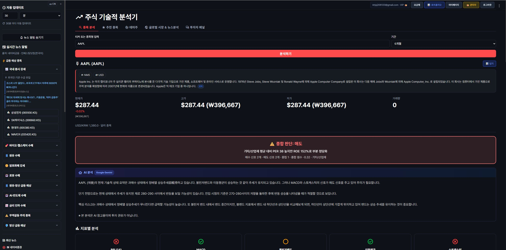
*AAPL 종목 분석 — 5단계 verdict + AI 분석*

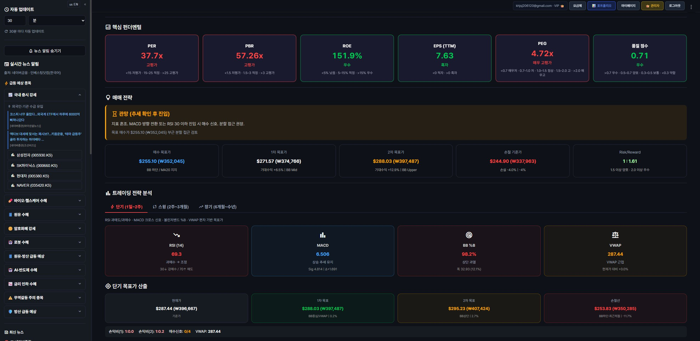
*펀더멘털 6지표 (PER/PBR/ROE/EPS/PEG/품질)*

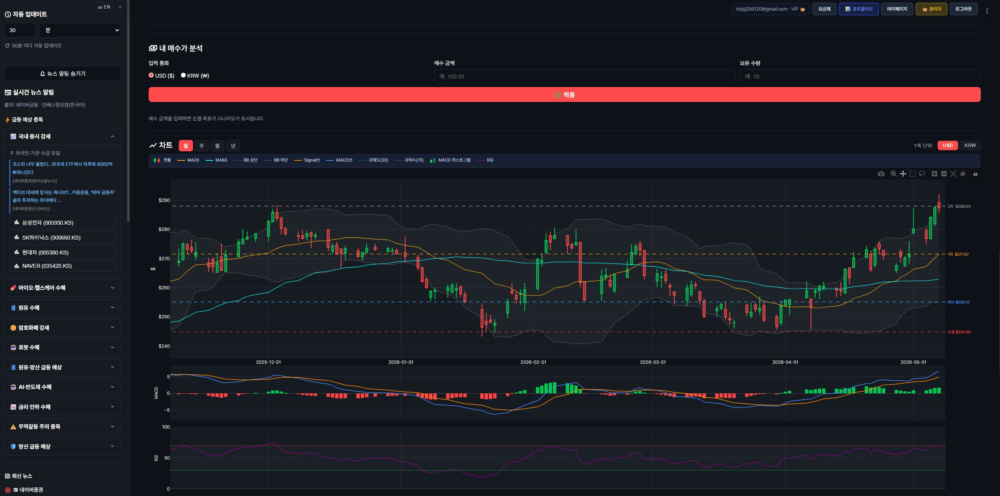
*Plotly 캔들차트 + MACD + RSI + 매수/목표/손절가*

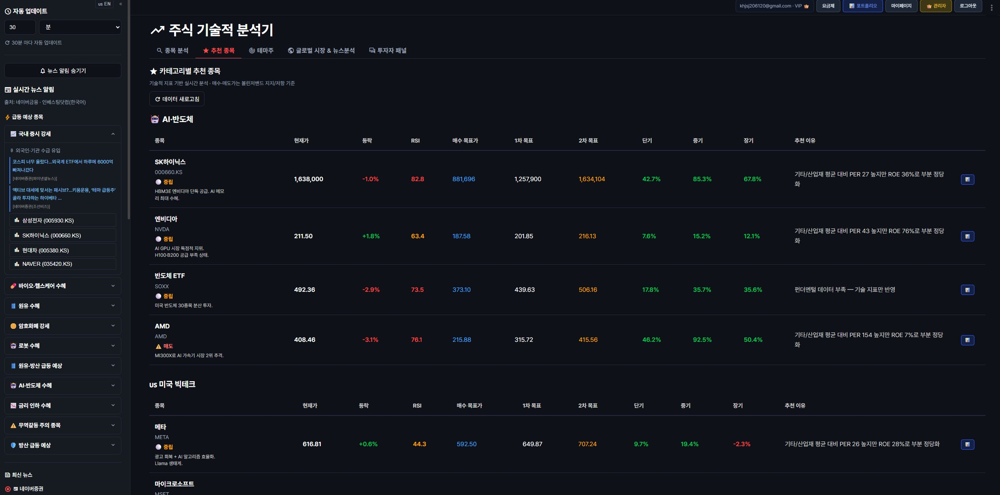
*AI·반도체 카테고리 추천 종목*

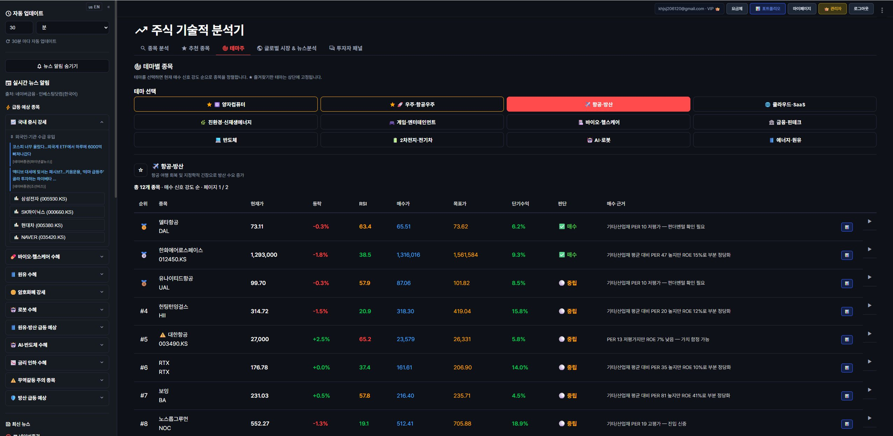
*항공·방산 테마 — 가치함정 자동 경고*

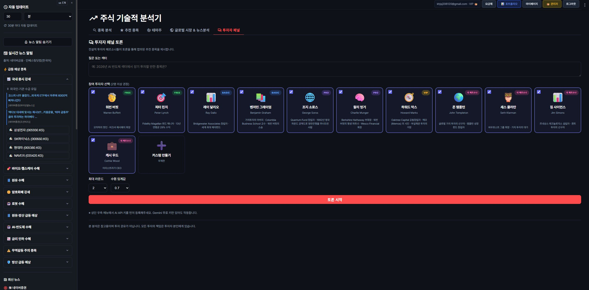
*7명 빌트인 페르소나 + 커스텀 페르소나*

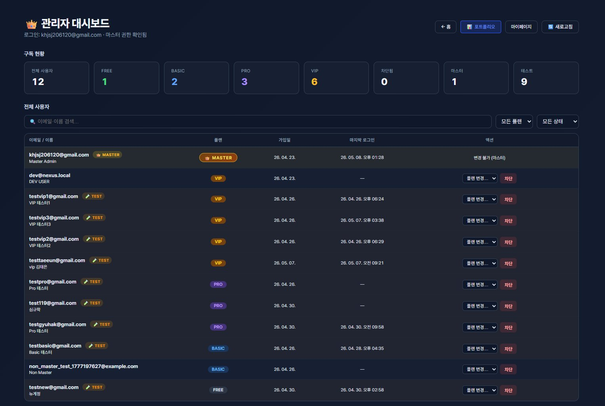
*등급별 사용자 관리 + 차단/플랜 변경*

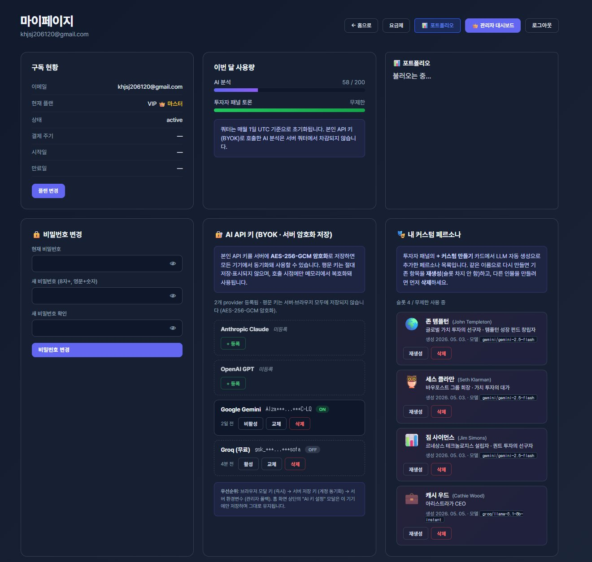
*BYOK AES-256-GCM 서버 암호화 + 커스텀 페르소나*

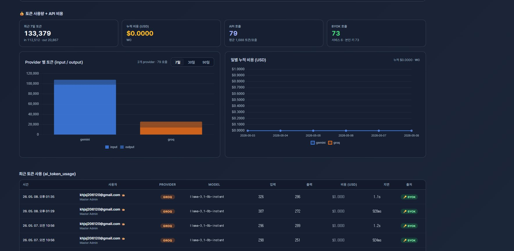
*ccusage 스타일 토큰·비용 추적 대시보드*

### 모바일

| 메인 | 포트폴리오 | 분석 결과 |
|---|---|---|
| 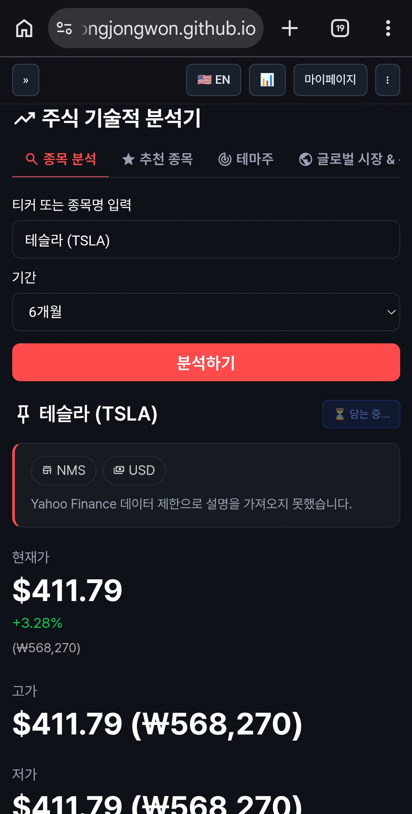 | 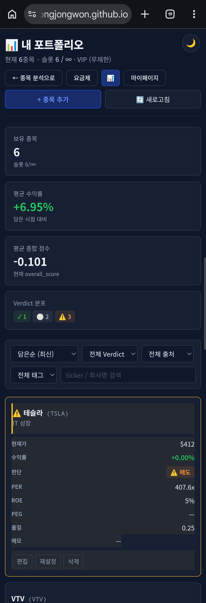 | 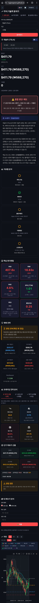 |

---

## 📌 프로젝트 소개

**StockAnalyzer**는 국내외 주식을 AI로 분석하고 포트폴리오를 관리하는 풀스택 웹 애플리케이션입니다.  
단순 시세 조회를 넘어 **펀더멘털 9지표 종합 평가 알고리즘**, **4-provider LLM 폴백 체인**, **BYOK(Bring Your Own Key) 서버 암호화**까지 직접 설계·구현했습니다.

---

## 🛠 기술 스택

| 영역 | 기술 |
|---|---|
| **Backend** | Python 3.14 · FastAPI · Uvicorn |
| **Database** | Supabase (PostgreSQL + RLS) |
| **Frontend** | Vanilla JS · Plotly.js · 반응형 (데스크탑 + 모바일) |
| **AI** | OpenAI · Anthropic · Google Gemini · Groq — 4-provider 폴백 체인 |
| **인증** | JWT (HS256) · Supabase Auth |
| **보안** | AES-256-GCM 서버 암호화 (BYOK) |
| **배포** | Render (Backend) · GitHub Pages (Frontend) |
| **데이터** | yfinance · 한국 종목 EPS 커스텀 폴백 로직 |

---

## ✨ 주요 기능

### 1. AI 종목 분석
- 티커 입력 → LLM 페르소나 기반 투자 토론 (4라운드)
- 5단계 verdict (강력매수 / 매수 / 중립 / 매도 / 강력매도)
- 펀더멘털 6카드 (PER · PBR · ROE · EPS · PEG · 품질점수) + sector-aware 임계값
- 한 줄 근거 자동 생성

### 2. 추천 종목 / 테마주
- 실시간 병렬 분석 (ThreadPoolExecutor) + 24h 캐시
- 강력매수 행 highlight + 가치함정 자동 경고
- 10가지 정렬 · 5종 필터

### 3. 나의 포트폴리오
- 5개 진입점 (분석 · 추천 · 테마 · 패널 · 직접입력)
- 메모 · 태그 · 목표가 · 손절가 관리
- 등급별 슬롯: Free 5 · Basic 30 · Pro 100 · VIP 무제한

### 4. AI 투자자 패널
- 빌트인 7개 페르소나 + 커스텀 페르소나 (Pro 1개 · VIP 무제한)
- 4-provider 폴백 체인 — 어느 키가 없어도 자동 다음 provider 시도

### 5. 관리자 대시보드
- 사용자 목록 · 등급 변경 · 차단/해제
- 토큰 · 비용 추적 + 관리자 액션 로그 · 에러 로그

---

## 🚀 로컬 실행

### Backend

```bash
git clone https://github.com/SongJongwon/StockAnalyzer_Backend.git
cd StockAnalyzer_Backend
python -m venv .venv
.venv\Scripts\activate
pip install -r requirements.txt
cp .env.example .env.local
uvicorn main:app --reload
```

### Frontend

```bash
git clone https://github.com/SongJongwon/StockAnalyzer_HTML.git
cd StockAnalyzer_HTML
# VS Code Live Server → index.html 우클릭 → Open with Live Server
```

---

## 🔬 개발 과정 하이라이트

### a. 멀티 LLM 폴백 체인
단일 AI provider 의존의 가용성 문제를 해결하기 위해 4-provider 폴백 체인을 설계했습니다.
- BYOK 3-tier: 요청 body → DB 암호화 저장값 → 서버 env 순으로 키 resolve
- 빈 응답도 실패로 간주 → 다음 provider 자동 시도

### b. 한국 주식 EPS 문제
yfinance가 한국 종목 EPS를 대부분 누락합니다. net_income / shares_out 으로 직접 계산하는 폴백 로직 구현.
결과: 005930(삼성전자) EPS null → 7,678 KRW 정상 계산

### c. BYOK AES-256-GCM 서버 암호화
사용자 AI API 키를 서버에 저장할 때 평문 보관을 완전히 제거했습니다.
- 96-bit random IV + GCM 인증 태그
- BroadcastChannel로 다중 탭 실시간 동기화

### d. 모바일 UX 전체 구축
데스크탑 전용이었던 앱을 모바일 완전 지원으로 전환 (5 PR · 17 commit)
- JS 0건 수정, CSS 미디어쿼리만으로 데스크탑 영향 완전 차단
- MutationObserver 안전망 · localStorage persist · 언어 sync

---

## 📊 주요 성과

| 항목 | 내용 |
|---|---|
| 단독 개발 | 기획 · 설계 · 개발 · 배포 · 운영 전 과정 |
| AI 통합 | 4-provider LLM 폴백 체인 |
| 보안 | BYOK AES-256-GCM · JWT · Supabase RLS |
| 알고리즘 | 펀더멘털 9지표 종합 평가 · 9개 업종 sector-aware |
| 반응형 | 데스크탑 + 모바일 완전 지원 |
| 구독 시스템 | 등급별 슬롯 + 관리자 대시보드 + 활동 로그 |

---

## 📄 라이선스

MIT License © 2026 SongJongwon
